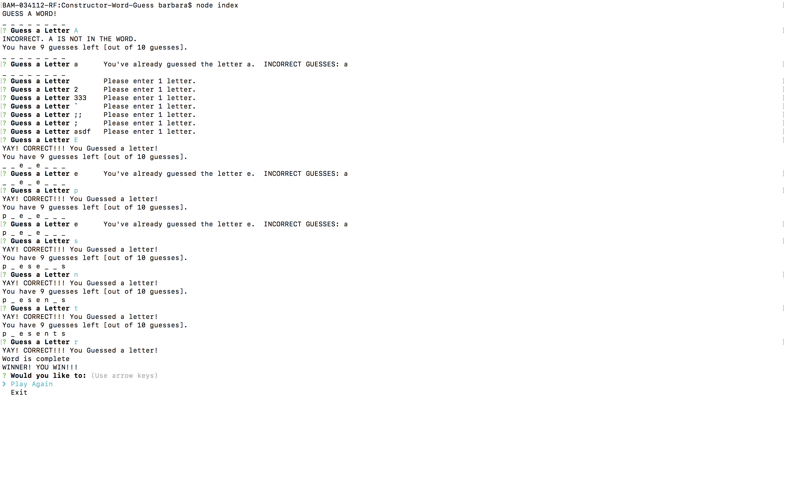
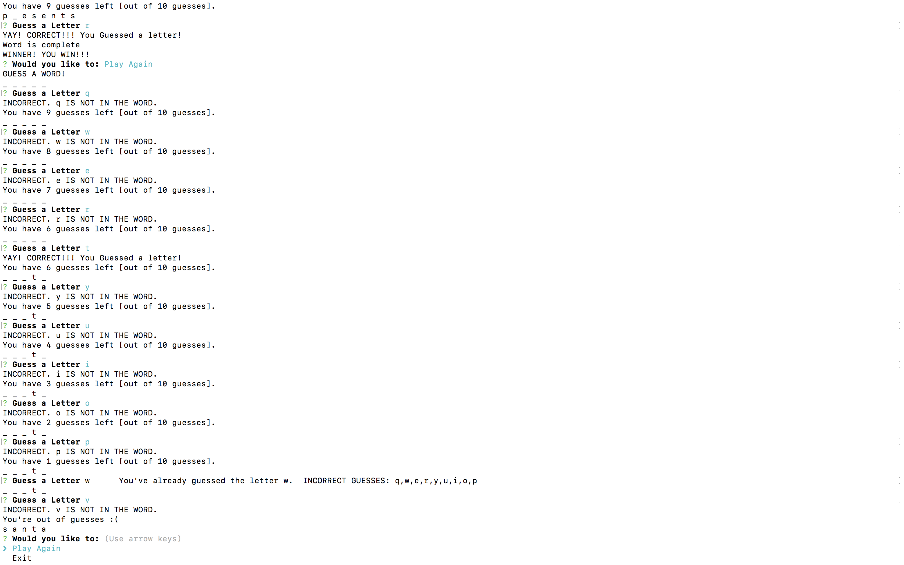

## Constructor-Word-Guess


#### This is a node js CLI word guessing game built using JavaScript constructors for Word and Letter
* main execution of program is within index.js and uses inquirer to prompt the player

##### The game starts with a random word been selected from the word list. 
* The word is selected from an array of word answer objects with the answer and also whether or not it has been asked.
* The word array is currently small for testing purposes
```javascript
var words = [
    { "answer": "reindeer", "asked": false },
    { "answer": "santa", "asked": false },
    { "answer": "presents", "asked": false },
    { "answer": "winter", "asked": false },
    { "answer": "tree", "asked": false },
];
```
* an array filter is called to choose a random word from the array based on whether or not it has been asked before
```javascript 
        wordsNotPlayed = wordsToGuess.filter(function (word) {
            return word.asked === false;
        })
```
* once all the words have been used, all the flags are flipped back to false
* The program displays x number of underscores to the user in the console window where x is the length of the word.
* Each underscore represents a letter in the word answer

##### The player is then prompted for guesses
* The player input is validate for a single alphabetic character with a regular expression
```javascript
if (/^[A-Za-z]{1}$/.test(letter)) return true;
```
* White space is removed from the player input
* The player input test against the CORRECT and INCORRECT guesses is CASE INSENSITIVE
* Player can only guess a letter once. The game will let you know if you guess the same letter and also show a list of your already guessed incorrect letters and redisplay the word answer with underscores/correct letters.  
* If the player guesses right, the letter is revealed.
* If guess is wrong, 'guesses left' will be reduced by one(1).


##### When the guesses left has reached zero (0)
* The game is over
* 'Lost' message 
* The correct word is revealed
* Inquirer prompts the user if they would like to play again or exit the program

##### When the word is guessed
* The game is over
* WINNER message 
* Inquirer prompts the user if they would like to play again or exit the program

##### When the user indicates they would like to play again
* A new word is chosen
* Game play repeats sequence




#### Dependencies
 * npm inquirer
